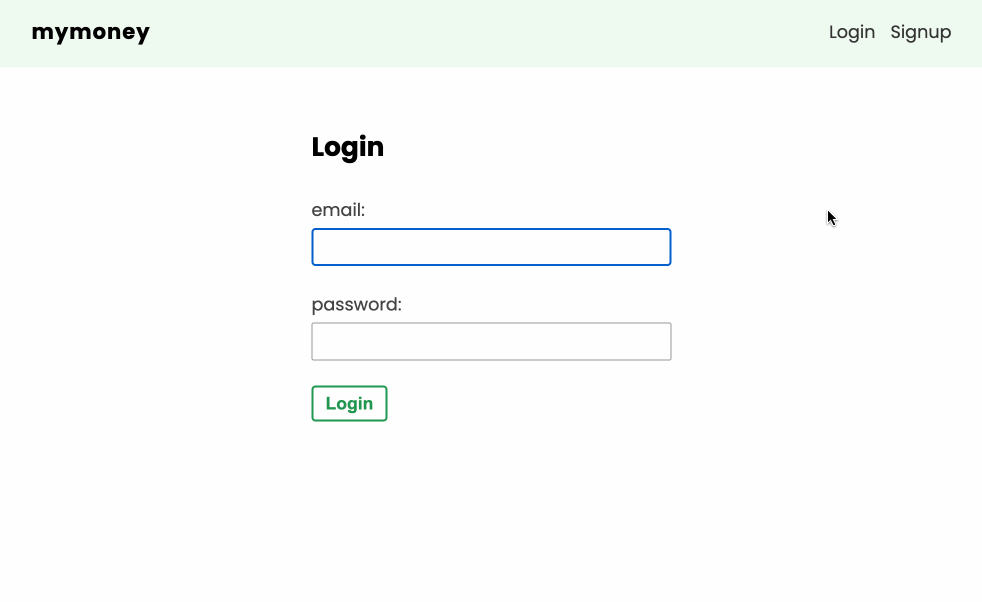

# My Money

這是來自 [Build Web Apps with React & Firebase](https://www.udemy.com/course/build-web-apps-with-react-firebase/) 課程的其中一項專案，主要是拿來練習 React 和 Firebase 而做的簡單帳本紀錄網站。

網站連結：[https://mymoney-2a81c.firebaseapp.com](https://mymoney-2a81c.firebaseapp.com)

**測試帳號一**

- 帳號：PeaNu@peanu.dev
- 密碼：123456

**測試帳號二**

- 帳號：PeaNu01@peanu.dev
- 密碼：123456

## 網站介紹

附註：由於此專案的重點著重在 **Firebase** 的練習，所以功能並沒有做很多。主要是學到了許多 Firebase 的知識與概念，我覺得這才是從這份專案中得到的最大收穫。

這個網站包含的功能有：

- 登入 / 註冊功能
- 權限管理（未登入時不可瀏覽帳本、只能編輯和刪除自己的帳本）
- 新增紀錄
- 刪除紀錄
- 基本的 UX 提升（loading 效果、錯誤訊息、提示訊息等等）




## 使用的技術

- React
- react-router-dom
- useReducer / useContext
- Custom hook
- CSS-Module
- Firebase authentication
- Firebase firestore
- FIrebase rule setting
- Firebase deploy
- Firebase CLI


## 運行方式

此專案使用 Firebase 的「Firestore」和「Authentication」服務，所以請先自行跑完相關的建立流程。

1\. 安裝專案的 dependencies

```bash
npm install
```

2\. 建立 `./src/firebase/config.js` 檔案，並填入你的 Firebase 資訊：

```js
import firebase from "firebase/app"
import 'firebase/firestore'

const firebaseConfig = {
  apiKey: "...",
  authDomain: "...",
  projectId: "...",
  storageBucket: "...",
  messagingSenderId: "...",
  appId: "..."
}

// init firebase
firebase.initializeApp(firebaseConfig)
// init services
const db = firebase.firestore()
const auth = firebase.auth()
const timestamp = firebase.firestore.Timestamp

export { db, auth, timestamp }
```

3\. 啟動開發環境

```bash
npm run start
```

## 打包

```bash
npm run build
```

之後再透過 live-sever 的方式打開 `/build/index.html` 即可
